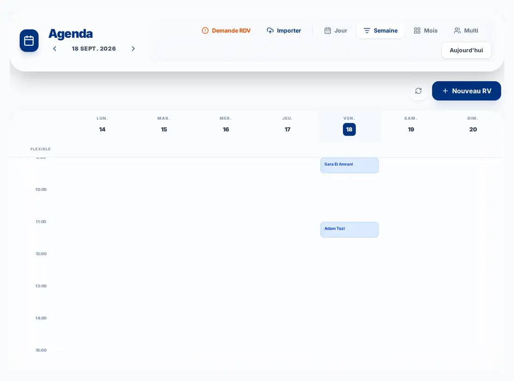

# Digital Crown

## Le cockpit clinique et administratif du cabinet dentaire

Digital Crown rassemble dans un même environnement les fonctions essentielles du cabinet : organisation quotidienne, dossier patient, suivi clinique, imagerie, documents, paiements, indicateurs et continuité de suivi.

L’objectif est simple : **réduire la friction au quotidien tout en améliorant la traçabilité et la lisibilité clinique**.

Digital Crown est conçu selon une architecture **local-first** : les données métier du cabinet restent sous le contrôle de l’installation du cabinet, avec des accès authentifiés et une organisation pensée pour un usage professionnel.

---

## Pourquoi Digital Crown ?

### Gagner du temps

Le praticien et son équipe retrouvent dans un même cockpit les informations utiles au rendez-vous, au dossier clinique, aux documents et au suivi administratif.

### Centraliser le dossier du patient

Les informations administratives, cliniques, radiologiques, documentaires et financières sont reliées au même patient afin de limiter les doubles saisies et les recherches dispersées.

### Renforcer la traçabilité

Les actes, documents, événements cliniques, suivis orthodontiques et principales actions restent structurés dans le temps.

### Garder le contrôle

Digital Crown assiste le cabinet sans remplacer le jugement du praticien. Une donnée absente reste absente ; une mesure calculée reste identifiable comme telle ; les décisions cliniques restent sous contrôle humain.

---

# Aperçu de Digital Crown

Les captures ci-dessous proviennent de **preuves visuelles réelles retenues dans le projet**, avec données de démonstration lorsque nécessaire. Elles illustrent le produit sans remplacer le contexte complet de chaque écran.

## Agenda

Vue hebdomadaire de l’agenda avec rendez-vous structurés dans le planning du cabinet.

## Suivi orthodontique longitudinal

Comparaison entre deux temps de traitement avec médias, mesures disponibles et deltas affichés de manière neutre.

## Céphalométrie

Étude céphalométrique avec repères, éléments à vérifier et rappel explicite de la validation clinique par le praticien.

---

# Les principaux modules

## Tableau de bord

Le tableau de bord donne une lecture rapide de l’activité du cabinet et des éléments nécessitant l’attention de l’équipe.

**Bénéfice :** commencer la journée avec une vision claire des priorités et des actions utiles.

## Agenda & organisation

Digital Crown centralise les rendez-vous et l’organisation du planning du cabinet, avec gestion des praticiens et des ressources lorsque le contexte l’exige.

**Bénéfice :** mieux organiser la journée, réduire les conflits de planning et garder une vision cohérente de l’activité.

## Dossier patient

Chaque patient dispose d’un dossier longitudinal regroupant les informations utiles à son suivi : données administratives, clinique, imagerie, documents, archives et finances.

**Bénéfice :** retrouver rapidement l’historique et le contexte utile sans naviguer entre plusieurs outils.

## Documents

Digital Crown permet de préparer et archiver les principaux documents du cabinet : ordonnances, devis, certificats, notes d’honoraires, échéanciers, lettres et rapports.

**Bénéfice :** produire des documents cohérents à partir du dossier patient et conserver une trace structurée de leur émission.

## Comptabilité & finances

Le cabinet peut suivre les actes, paiements, échéanciers, impayés et principaux indicateurs financiers liés à l’activité.

**Bénéfice :** relier plus simplement l’activité clinique au suivi administratif et financier.

## Indicateurs

Les écrans d’indicateurs permettent d’observer l’activité du cabinet à partir des données disponibles.

**Bénéfice :** disposer d’une lecture synthétique de l’activité sans sortir du cockpit.

## Bibliothèque clinique & Science Hub

Digital Crown intègre des surfaces de consultation de références et ressources cliniques destinées à accompagner le praticien.

**Bénéfice :** garder les ressources utiles proches du contexte de travail.

Ces ressources sont des outils d’aide et ne remplacent pas l’analyse clinique du praticien.

## Approvisionnement

Le cockpit intègre également une surface d’approvisionnement et de consultation des partenaires et produits référencés.

**Bénéfice :** rapprocher certaines tâches d’approvisionnement de l’environnement quotidien du cabinet.

---

# Imagerie & orthodontie

## Céphalométrie

Digital Crown permet d’importer une étude, de travailler avec des repères céphalométriques, de corriger les landmarks et de calculer des mesures géométriques disponibles dans le système.

Les résultats restent traçables et doivent toujours être interprétés dans leur contexte clinique.

**Bénéfice :** centraliser l’étude céphalométrique dans le dossier patient tout en gardant visibles les mesures et leur provenance.

## Panoramique

Le studio panoramique permet de travailler sur l’imagerie, les annotations et les éléments de rapport prévus par le produit.

**Bénéfice :** rapprocher l’imagerie du dossier patient et du reste du suivi clinique.

## Suivi orthodontique longitudinal

Le suivi orthodontique structure la chronologie du traitement : phases, contrôles, événements, timepoints et comparaisons disponibles entre différents moments du traitement.

**Bénéfice :** suivre l’évolution dans le temps sans créer un dossier parallèle au dossier patient.

Une variation numérique n’est pas automatiquement interprétée comme une amélioration, un échec ou une indication thérapeutique. L’interprétation appartient au praticien.

---

# Digital Crown au quotidien

Un parcours type peut se résumer ainsi :

1. **Le patient arrive au cabinet** : l’équipe retrouve son rendez-vous et son dossier.
2. **Le praticien ouvre le dossier patient** : contexte, historique, clinique, imagerie et éléments utiles sont accessibles dans le même environnement.
3. **L’acte et les documents sont réalisés** : les informations et documents associés sont structurés dans le dossier.
4. **Le suivi administratif est enregistré** : paiement, échéancier ou éléments financiers sont reliés au parcours du patient.
5. **Le suivi continue** : rendez-vous, alertes, contrôles, documents et événements successifs enrichissent l’historique.

---

# Extensions mobiles

## Digital Crown Mobile

La PWA mobile est une extension du cockpit du cabinet. Elle peut être appairée à l’installation Digital Crown afin d’accéder aux surfaces mobiles prévues par le produit.

Elle est conçue comme un complément au poste principal, notamment pour certaines consultations rapides, vues de contexte et usages mobiles du cabinet.

## Patient Companion

Patient Companion constitue une interface séparée destinée au patient pour les interactions et informations explicitement partagées par le cabinet dans ce cadre.

Son accès repose sur un mécanisme d’appairage/autorisation dédié et ne transforme pas le patient en utilisateur du dossier clinique complet du cabinet.

---

# Données, confidentialité et sécurité

Digital Crown est conçu selon un principe **local-first**.

Selon l’installation retenue :

- les données métier sont conservées sous l’autorité de l’installation du cabinet ;
- les accès sont authentifiés ;
- les droits utilisateurs limitent l’accès aux fonctions selon le rôle ;
- les dossiers et médias sensibles ne sont pas exposés comme de simples fichiers publics ;
- les sauvegardes font partie de la stratégie normale de continuité du cabinet.

Certaines fonctions d’identité, de licence ou certains services associés peuvent nécessiter une connexion Internet. Le cœur métier reste conçu autour du fonctionnement local du cabinet.

---

# Sauvegarde & continuité

Une installation professionnelle doit être accompagnée d’une stratégie de sauvegarde régulière.

Le cabinet doit notamment veiller à :

- conserver des sauvegardes selon la politique définie lors de l’installation ;
- vérifier régulièrement qu’elles sont exploitables ;
- protéger les supports ou destinations de sauvegarde ;
- ne jamais improviser une restauration sur la base de travail sans procédure adaptée.

Les opérations de restauration ou de migration importantes doivent suivre les procédures de maintenance prévues.

---

# Praticien et équipe du cabinet

Digital Crown est pensé pour un usage partagé entre le praticien et les membres autorisés de son équipe.

Les droits et surfaces accessibles peuvent différer selon le rôle de l’utilisateur afin de limiter les actions aux besoins réels du cabinet.

---

# Prise en main rapide

1. **Configurer le cabinet** et les principaux paramètres de fonctionnement.
2. **Créer ou retrouver un patient** depuis la liste des patients.
3. **Organiser les rendez-vous** dans l’agenda.
4. **Utiliser le dossier patient** pour les informations cliniques, l’imagerie, les documents et le suivi.
5. **Mettre en place la sauvegarde** et vérifier que l’équipe connaît les procédures essentielles.

Les procédures détaillées d’installation, de maintenance et de restauration sont fournies séparément lorsque nécessaire.

---

# Prérequis minimums

L’environnement exact dépend du mode d’installation retenu. De manière générale, le cabinet doit disposer :

- d’un poste principal compatible avec l’installation Digital Crown ;
- d’un réseau local fonctionnel lorsque plusieurs postes ou extensions mobiles doivent communiquer avec le poste/serveur du cabinet ;
- d’une stratégie de sauvegarde adaptée ;
- des périphériques utiles au fonctionnement du cabinet selon ses usages : imprimante, scanner ou équipements d’imagerie lorsqu’ils font partie du workflow.

---

# Cadre d’utilisation

Digital Crown est un outil d’assistance au fonctionnement du cabinet.

Il ne remplace pas :

- l’examen clinique ;
- le diagnostic du praticien ;
- la décision thérapeutique ;
- la vérification des données avant utilisation clinique ;
- les obligations professionnelles et réglementaires applicables au cabinet.

Lorsqu’une information n’est pas disponible ou qu’une fonction ne possède pas un niveau de preuve suffisant pour produire une interprétation clinique automatique, Digital Crown doit conserver cette limite visible plutôt que fabriquer une conclusion.

---

# En cours de construction

Digital Crown continue d’évoluer. Les modules suivants appartiennent à la prochaine étape produit et sont **en cours de construction** :

### SteriTrace
Traçabilité du cycle de stérilisation et des instruments.

### Implant Passport
Traçabilité des implants, biomatériaux, références et lots associés.

### Consent Vault
Gestion de consentements structurés, signés et versionnés.

### Post-Op
Suivi postopératoire structuré après certains actes.

### Referral Loop
Suivi des correspondants et des parcours d’adressage.

### PhotoCase
Photographie clinique standardisée et suivi avant/après.

### Evidence Pack
Constitution d’un dossier médico-administratif chronologique et exportable.

Deux surfaces complémentaires du produit sont également **en cours de construction** dans la version actuelle : **Module Labo** et **Salle d’attente**.

La présence d’un module dans cette section ne signifie pas qu’il est déjà livré ni qu’une date de disponibilité est garantie.

---

# Support & maintenance

Digital Crown est prévu pour être accompagné d’un suivi de maintenance adapté à l’installation du cabinet.

Ce suivi peut comprendre selon le contrat et le contexte :

- accompagnement à la prise en main ;
- maintenance corrective ;
- mises à jour du produit ;
- vérification de la stratégie de sauvegarde ;
- assistance lors d’opérations techniques importantes.

Les coordonnées et conditions contractuelles de support sont communiquées séparément afin que ce document reste valable indépendamment de l’organisation commerciale.

---

# Questions fréquentes

### Mes données sont-elles stockées dans un SaaS distant ?

Le fonctionnement métier de Digital Crown est conçu en local-first : la source de vérité du cabinet reste sous le contrôle de l’installation locale prévue.

### Digital Crown fonctionne-t-il sans Internet ?

Le cœur métier est conçu pour fonctionner localement. Certaines fonctions d’identité, de licence ou certains services associés peuvent nécessiter une connexion.

### Puis-je utiliser Digital Crown sur plusieurs postes ?

Oui lorsque l’installation et le réseau local du cabinet sont configurés pour cet usage.

### Existe-t-il une version mobile ?

Oui. Digital Crown comprend une extension mobile appairée au cabinet, ainsi qu’un Patient Companion séparé pour les interactions patient prévues.

### Qui réalise les sauvegardes ?

La politique de sauvegarde doit être définie avec le cabinet lors de l’installation et de la maintenance. Une sauvegarde n’est considérée utile que si sa restauration peut être vérifiée.

### Les fonctions d’imagerie donnent-elles automatiquement un diagnostic ?

Non. Elles fournissent des outils, mesures, annotations ou signaux selon la fonction concernée. La décision clinique appartient au praticien.

### Comment sont gérées les mises à jour ?

Les mises à jour doivent suivre le processus de maintenance prévu pour l’installation du cabinet afin de protéger les données et la continuité de fonctionnement.

---

## À retenir

**Digital Crown est un cockpit clinique et administratif conçu pour réunir le fonctionnement quotidien du cabinet autour d’un dossier patient structuré, local-first et traçable.**

Le produit cherche un équilibre simple : **moins de friction administrative, plus de continuité dans l’information, sans retirer au praticien le contrôle de la décision clinique.**

---

*Document client — Digital Crown — révision du 20 septembre 2026.*
