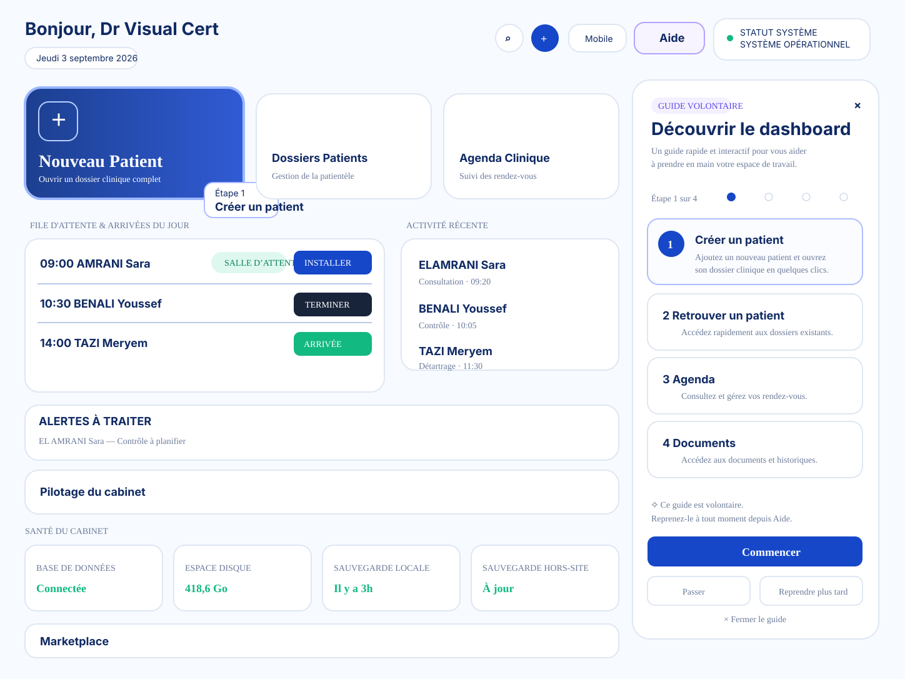

# Digital Crown — Voluntary Contextual Tutorial — Canonical Roadmap

Status: OPEN
Canonical file: `docs/ux/DIGITAL_CROWN_VOLUNTARY_CONTEXTUAL_TUTORIAL_CANONICAL.md`
Repo: `hraaaaf/Digital_crown`
Branch: `ux/voluntary-contextual-tutorial-canonical`
Base master at chantier creation: `84b9c0ea1fc7b4d10ea7182535053869e1a2b17a`

## Goal final

Créer un nouveau système de tutoriel Digital Crown utile, contextuel et **100 % volontaire**, qui aide à comprendre les workflows critiques sans jamais interrompre spontanément le travail clinique.

## Succès observable

Le chantier n'est CLOSED que si :

- aucun tutoriel ne démarre automatiquement au lancement, au montage Dashboard, au retour de route, au refresh ou à une nouvelle session ;
- l'utilisateur lance explicitement le guide depuis une entrée `Aide` / `Guide` claire mais discrète ;
- les guides sont courts, contextualisés et limités aux workflows réellement complexes ;
- l'utilisateur peut `Passer`, `Fermer` et `Reprendre plus tard` ;
- la progression peut être reprise sans bloquer le produit ;
- les états responsive et les rôles ciblés sont certifiés ;
- le rendu final respecte la référence visuelle approuvée ci-dessous ;
- les tests source + runtime + visuels prouvent le comportement ;
- aucun déploiement Vercel n'est effectué sans autorisation explicite.

## Référence visuelle officielle — APPROUVÉE

Le mockup généré et validé par l'utilisateur le 3 septembre 2026 est la **référence visuelle officielle / Goal UI** du chantier.

Nom de référence : `Voluntary Contextual Tutorial — Dashboard Guide Mockup v1`

Source originale validée : `a_clean_modern_saas_dashboard_ui_mockup_wide_des_1.png` — 1448×1086.
SHA-256 de l'original validé : `fbdc815dca91b051a44667db10958493ee225c1bc2b3857b518c82488285cc59`.

Référence visuelle versionnée dans le repo :

Le SVG versionné est une transcription vectorielle fidèle des invariants du mockup approuvé. En cas de doute de détail visuel, les invariants ci-dessous + le hash de l'original validé font foi.

### Invariants visuels à reproduire

- Dashboard existant préservé, pas de refonte globale opportuniste ;
- entrée `Aide` / `Guide` visible en haut de l'interface mais non intrusive ;
- ouverture uniquement sur action explicite utilisateur ;
- panneau latéral droit premium, clair, non bloquant ;
- label `GUIDE VOLONTAIRE` ;
- titre de type `Découvrir le dashboard` ;
- progression `Étape 1 sur 4` ;
- liste courte de parcours ;
- étape active mise en évidence ;
- spotlight / contour doux sur la cible, jamais d'overlay agressif plein écran ;
- actions explicites `Commencer`, `Passer`, `Reprendre plus tard`, `Fermer le guide` ;
- microcopy rappelant que le guide est volontaire ;
- esthétique healthcare SaaS calme, arrondie, espacée et cohérente avec Digital Crown.

### Parcours du mockup v1

1. `Créer un patient`
2. `Retrouver un patient`
3. `Agenda`
4. `Documents`

Ces quatre items servent de point de départ, pas de dogme fonctionnel. TUTO-1 a vérifié dans le produit lesquels méritent réellement un guide.

## Règle UX non négociable

**Le tutoriel ne doit jamais devenir une condition d'utilisation de Digital Crown.**

Pas de :

- auto-launch ;
- timer d'apparition ;
- reprise forcée ;
- overlay global bloquant ;
- relance automatique après refresh ;
- relance automatique après retour Dashboard ;
- popup promotionnelle de type “Découvrez les nouveautés” déguisée en aide.

## BEFORE de référence

Chantier précédent `Dashboard Tutorial UX` fermé sur master `84b9c0ea1fc7b4d10ea7182535053869e1a2b17a`.

État certifié :

- aucun `DayOneTour` ;
- ancien `GuidedTour` / `TourLauncher` retiré ;
- `GuideTower` retiré ;
- Clinical Tips automatiques retirés ;
- Dashboard sans tutoriel ni bulle spontanée ;
- Dashboard Visual Certification final précédent : run `33779398362`, 5/5 artifacts visuels verts ;
- runtime précédent : `33782891558` SUCCESS ;
- CI closeout précédent : `33782891425` SUCCESS.

Le BEFORE de ce nouveau chantier est donc volontairement **un produit calme sans tutoriel**. Toute régression vers une interruption automatique est interdite.

## Lots

### TUTO-1 — Audit des parcours critiques — DONE

Goal : déterminer où une aide guidée crée une vraie valeur.

Preuve source auditée sur la branche `ux/voluntary-contextual-tutorial-canonical` :

- `frontend/src/App.tsx` : routes protégées `/dashboard`, `/patients`, `/patients/new`, `/patients/:id`, `/patients/:id/archives`, `/agenda` dans le même `MainLayout` ;
- `frontend/src/components/Layout/MainLayout.tsx` : `Header` persistant au-dessus des routes protégées ;
- `frontend/src/components/Header.tsx` : zone haute globale existante pour réglages/notifications/profil, adaptée à une entrée `Aide / Guide` discrète ;
- `frontend/src/features/dashboard/components/DashboardHeader.tsx` : recherche patient explicite, menu `Ajout rapide`, liens vers `/patients/new` et `/agenda` ;
- `frontend/src/features/dashboard/components/QuickActions.tsx` : accès Dashboard vers nouveau patient, dossiers patients et agenda ; ancre existante `data-tour="quick-action-new-patient"` ;
- `frontend/src/features/patients/PatientList.tsx` : recherche directe nom/prénom/n° dossier, tri, vues table/grille et création depuis absence de résultat ;
- `frontend/src/features/patients/AddPatientForm.tsx` : workflow multi-section avec n° dossier, disponibilité asynchrone, identité, validation et anti-doublon avant création ;
- `frontend/src/pages/AgendaPage.tsx` + `frontend/src/features/agenda/AgendaStudio.tsx` : studio Agenda avec vues jour/semaine/mois/multi, navigation temporelle, demandes, import et création RDV ; ancres existantes `data-tour="agenda-header"` et `data-tour="agenda-view-switcher"` ;
- `frontend/src/features/patients/PatientDetailsInner.tsx` : accès Documents depuis l'action rapide et l'onglet patient via `?tab=admin`, avec `data-tour="patient-tabs"` ;
- `frontend/src/features/admin/DocumentHub.tsx` : Document Studio multi-type, onglets, génération, preview, gestion de brouillons/dialogues ; ancre existante `data-tour="document-tabs"` ;
- `frontend/src/utils/accessControl.ts` : permissions `patients` et `agenda` déterminées par rôle/permissions ; secrétaire et dentiste salarié historiques ont par défaut accès aux deux ; admin, propriétaire et superadmin sont autorisés ;
- `frontend/src/features/admin/DocumentStudio/DocumentStudioPermissionPolicy.ts` : types de documents filtrés par permissions (`prescriptions`, `patients`, `accounting`, `clinical`) ;
- `frontend/src/features/admin/components/CrownGuide.tsx` existe encore comme ancien composant visuel animé. Il n'est **pas retenu** comme architecture du nouveau tutoriel : son rendu flottant/pulsant ne correspond ni au Goal UI ni au caractère volontaire exigé. Son éventuelle suppression relève de TUTO-3 seulement après vérification de ses imports/usages.

#### Audit 1 — Créer un patient — GUIDE RETENU

- Route principale : `/patients/new`.
- Entrées : Dashboard `QuickActions`, menu `Ajout rapide`, liste patients.
- Composant cœur : `AddPatientForm`.
- Actions critiques : vérifier/attribuer le n° dossier, identité requise, informations complémentaires, validation, contrôle anti-doublon, décision en cas de doublon, création finale.
- Difficulté : **moyenne à élevée**. Le workflow contient plusieurs états asynchrones et une décision anti-doublon qui justifient une aide courte.
- Ancres : réutiliser l'entrée `data-tour="quick-action-new-patient"`, puis ajouter des `data-guide` stables sur les sections réellement guidées plutôt que cibler des classes CSS.
- Rôles : utilisateurs disposant de `patients` ; typiquement admin/propriétaire/superadmin, secrétaire et dentiste salarié selon permissions.
- Décision : **guide complet retenu**, cible 3 à 4 étapes maximum.

#### Audit 2 — Retrouver un patient — PAS DE GUIDE AUTONOME

- Routes : `/dashboard` pour la recherche rapide, `/patients` pour la liste complète.
- Composants : `DashboardHeader`, `usePatientSearch`, `PatientList`.
- Actions critiques : ouvrir la recherche, saisir nom/prénom/n° dossier, sélectionner un résultat ; ou filtrer la liste patients.
- Difficulté : **faible**. Le Dashboard expose déjà une recherche directe avec placeholder, résultats et état vide ; la liste patients possède un champ de recherche explicite.
- Ancres : ajouter si nécessaire une seule ancre `data-guide="patient-search"` au bouton/champ Dashboard.
- Rôles : utilisateurs disposant de `patients`.
- Décision : **pas de guide autonome**. Conserver cette action comme micro-étape optionnelle dans `Découvrir le dashboard`. Créer un guide multi-étapes ici ajouterait plus de bruit que d'aide.

#### Audit 3 — Agenda / rendez-vous — GUIDE RETENU

- Route : `/agenda`.
- Entrées : Dashboard `QuickActions`, menu `Ajout rapide`, action `RDV` depuis un dossier patient avec préremplissage.
- Composants : `AgendaPage`, `AgendaStudio`, vues jour/semaine/mois/multi et modales Agenda/frontdesk/import.
- Actions critiques : comprendre les vues, naviguer dans le temps, créer/modifier un RDV, traiter les demandes, distinguer les états et éventuellement importer.
- Difficulté : **élevée** par densité fonctionnelle et changements de contexte.
- Ancres : `data-tour="agenda-header"`, `data-tour="agenda-view-switcher"`, puis ancres stables dédiées aux actions de création réellement retenues.
- Rôles : utilisateurs disposant de `agenda` ; typiquement admin/propriétaire/superadmin, secrétaire et dentiste salarié selon permissions.
- Décision : **guide complet retenu**, centré sur le RDV quotidien ; import, multi-praticien et réglages avancés restent hors guide initial.

#### Audit 4 — Documents — GUIDE RETENU, CONTEXTUEL AU PATIENT

- Route réelle : `/patients/:id?tab=admin` dans le dossier patient ; `/patients/:id/archives` existe séparément pour les archives.
- Entrées : action rapide `Document` et onglet `Documents` dans `PatientDetailsInner`.
- Composants : `PatientDetailsInner`, `DocumentHub`, `StudioHeader`, `StudioTabs`, `DocumentHubContent`, `StudioFooter`, preview/dialogues.
- Actions critiques : choisir un type autorisé, saisir les données propres au type, générer/prévisualiser, gérer un changement d'onglet avec brouillon, finaliser.
- Difficulté : **élevée** et variable selon le type de document.
- Ancres : `data-tour="patient-tabs"`, `data-tour="document-tabs"` et nouvelles ancres `data-guide` sur génération/preview si nécessaires.
- Rôles : guide filtré selon les onglets réellement autorisés. Secrétaire legacy : certificat via permission patients mais pas ordonnance/comptabilité/clinique ; dentiste salarié legacy : ordonnance + certificat ; admin/propriétaire : ensemble des types autorisés par politique.
- Décision : **guide complet retenu**, dynamique selon les permissions ; ne jamais montrer une étape vers un onglet inaccessible.

#### Candidats supplémentaires — NON RETENUS POUR V1

- Réglages : nombreux mais administratifs et non indispensables au workflow quotidien ; un guide générique augmenterait le bruit et serait fortement dépendant du rôle.
- Import CSV patients, import Google Agenda, multi-praticien, documents financiers avancés : fonctions secondaires/avancées à documenter contextuellement plus tard si les données d'usage le justifient.
- Mobile : explicitement hors périmètre de ce chantier.

#### Shortlist TUTO-1 verrouillée

Guides complets V1 :

1. `Créer un patient` ;
2. `Agenda / prendre un rendez-vous` ;
3. `Documents depuis un dossier patient`.

Micro-guide Dashboard uniquement :

- `Retrouver un patient` = une étape optionnelle dans `Découvrir le dashboard`, sans séquence autonome.

Aucun autre guide n'est retenu pour V1.

#### Point d'entrée Aide / Guide retenu

**`Header` global dans `MainLayout`**.

Justification :

- visible sur toutes les routes protégées concernées ;
- évite qu'un guide disparaisse lorsqu'il navigue du Dashboard vers Patient/Agenda/Documents ;
- correspond à la zone haute du Goal UI ;
- permet une ouverture strictement explicite ;
- ne surcharge pas les cartes métier ;
- `DashboardHeader` reste spécifique au Dashboard et n'est donc pas le bon propriétaire du système global.

Implémentation attendue : bouton discret `Aide / Guide` dans `Header`, sans badge animé, pulse, timer ni notification proactive.

### TUTO-2 — UX architecture + interaction model — OPEN

Goal : transformer le mockup approuvé et la shortlist TUTO-1 en spécification réalisable.

À verrouiller :

- bouton `Aide / Guide` global dans `Header` ;
- panneau latéral droit non bloquant ;
- spotlight doux ciblé par attributs `data-guide` stables ;
- modèle de guide route-aware sans auto-navigation surprise ;
- progression et reprise strictement déclenchées par l'utilisateur ;
- états `idle`, `in_progress`, `paused`, `completed`, `dismissed` ;
- sémantique exacte de `Passer`, `Reprendre plus tard`, `Fermer` ;
- persistance locale sans auto-launch ;
- accessibilité clavier / focus ;
- responsive ;
- filtrage des guides et étapes par permissions ;
- règle de comportement si une cible/route n'est pas disponible.

Preuve attendue : spec + mockup de référence + mapping composants/routes + tests proposés.

### TUTO-3 — Implémentation — PENDING

Goal : implémenter le système minimal suffisant.

Principe : ne réintroduire `react-joyride` ou une autre dépendance que si l'architecture démontre un gain concret. Sinon privilégier un composant maison simple, testable et cohérent avec le produit.

Preuve attendue : code + tests unitaires/intégration + absence prouvée d'auto-launch.

### TUTO-4 — Certification UI/UX — PENDING

Process obligatoire :

BEFORE → Goal écrit → référence/mockup → implémentation → AFTER mêmes viewports → comparaison + tests → score visuel.

Matrix minimale :

- rôles pertinents ;
- desktop 1440 / 1024 / 768 ;
- mobile 430 / 390 si le guide est exposé sur mobile ;
- open / close / skip / pause / resume ;
- route return ;
- refresh ;
- new session ;
- preuve négative : aucune ouverture automatique.

## Score cible

UX cible interne : **≥ 9/10** sans sacrifier le caractère volontaire.

Le score ne peut être 10/10 sans preuve runtime + visuelle + accessibilité suffisante sur les parcours retenus.

## Dette / garde-fous

- `react-joyride` est encore déclaré comme dépendance potentiellement morte ; ne pas le réactiver par réflexe.
- `CrownGuide.tsx` ne doit pas être réutilisé tel quel pour ce chantier ; vérifier ses usages avant toute suppression.
- Ne pas mélanger ce chantier avec Documents A5, SEC-1, Mobile ou Portability.
- Pas de déploiement Vercel sans autorisation explicite.

## Next exact

**TUTO-2 : définir l'architecture minimale du bouton Header + panneau droit + progression route-aware + persistance volontaire + filtrage par permissions, puis verrouiller le mapping des étapes et la matrice de tests avant de coder.**

## Séquence restante

TUTO-2 architecture UX → implémentation TUTO-3 → tests source/runtime → AFTER mêmes viewports → comparaison au mockup approuvé → score → canonical closeout → PR/merge → post-merge.
